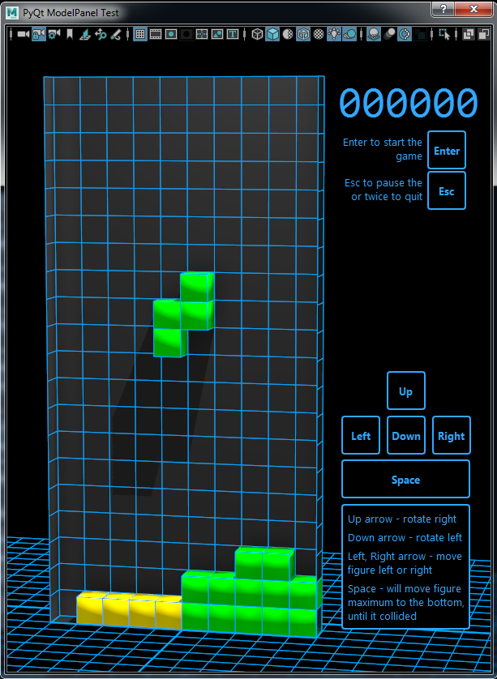

```
Developed by
Andrew Golubev
golubevcg@gmail.com
```

List of technologies and frameworks, which were used in-game:
- PythonAPI, 
- cmds, 
- shiboken2
- PySide2
- Mel

Tetris game inside Autodesk Maya. 
>Be careful, i do not recommend launching this in production computers. \
Tetris during execution time will override Maya colors, 
yes after closing the Tetris window -  it will reset to your settings (saved before launch), \
but if something will go wrong, you will have a crash - your settings can
be lost.

To launch simply paste in Maya script editor and launch code.py

Game controls:
- Left / Right arrows to move an active figure
- Up / Button arrows to rotate an active figure
- Space to fast fall figure until collided
- Esc to pause / Enter to continue
- Esc twice to exit game and close application.

Launched app:




